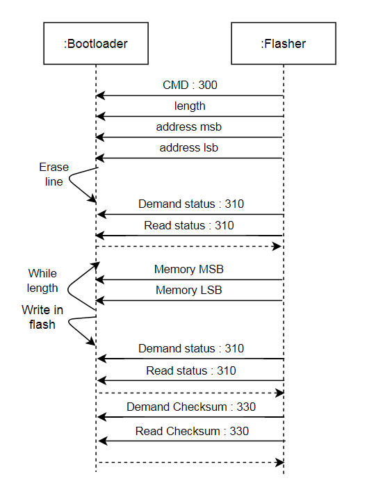

# Bootloader V3.0

Cette version du bootloader permet d'écrire une application dans la memoire flash au travers du SPI avec contrôle des paquets.
Le protocole de communication mis en place s’appuie sur le S19.

Améliorations par rapport a la version V2.2:
- Changement du protocole de communication et des commandes reseaux
- Modification de l'algorithme pour s'adapter aux nouvelles commandes reseaux
- Protection de la memoire flash (Bootloader + Vecteurs application)
- Amelioration des codes status

Améliorations par rapport a la version V2.0:
- Sauvegarde des vecteurs dans la memoire flash
- Chargement des vecteurs à chaque lancement de l'application

### I - Protocole de communication

#### 1. Commandes et status

Commandes : 
300 : Write  
310 : Read status  
330 : Read checksum  
500 : Effacer la memoire  
700 : Lancer le programme  

Status :  
30 : Vous avez la main sur le bootloader. Prêt a lancer l'application ou Jumper  
20 : Occupé (En train d'écrire ou en train d’effacer)  
10 : En processus de flash, prêt a continuer  
5 : Erreur lors de l'écriture : zone memoire protege

#### 2. Protocole d'écriture

