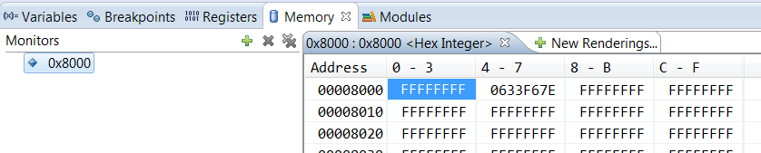

### Utlisation du code de manipulation de la memoire flash

Pour manipuler la memoire flash, il faut dans un premier temps initialiser la clock pour permettre les opérations.

Il est probable que lorsque l'on essaie d'écrire dans la flash, le microcontroleur se bloque et tourne en boucle
dans une fonction d'erreur.
Lorsque le programme tourne en mode débug avec code warrior, soit le programme se bloque et affiche une erreur,
soit losque que l'on met sur pause on se retrouve a des endroits aléatoires du code.
Il est possible de pallier a ce problème en modifiant quelques lignes de code (voir paragraphe plus bas).

Note : La fonction Flash_read() n'a pas été testé et peut être amélioré en fonction du besoin.

#### Initialisation de la clock pour manipuler la memoire flash

````C
void Flash_clock_init(){
	// Intern clock init 
	ICSSC = 0x70;
	// Flash clock init
	FCDIV_FDIVLD = 1;
	FCDIV_PRDIV8 = 1;
	FCDIV_FDIV = 0x8; 
}

````


#### Code

> Il manque la fonction erase (en cour de developpement)

````C
void Flash_write(unsigned long address, unsigned int value){
	unsigned long *pdst;
	FSTAT_FCBEF = 1;
	if (!FSTAT_FACCERR && !FSTAT_FPVIOL){ FSTAT = 0x30;}
	pdst = (unsigned long *)(address);
	*pdst = value;
	FCMD = 0x20; 
	FSTAT = 0x80;
	while (!FSTAT_FCCF){}
}

unsigned long Flash_read(unsigned long address, unsigned int value){
	unsigned int val_memory;
	val_memory = (unsigned long)*val_memory_read;
	// spi2_tx.U16 = (*val_memory_read<< 16)/65536; //MSB
	// spi2_tx.U16 = (*val_memory_read & 0xFFFF0000)/65536; // LSB
	
	return val_memory;
}
````

#### Solution de l'erreur lors de l'écriture  :
Si il y a un problème d'accès à la memoire, il faudra effectuer les modification suivantes :

Remplacer la fonction dans le fichier suivant :
exeption.c > asm_exception_handler()

````C
asm  __declspec(register_abi) void asm_exception_handler(void)
{
	addq.l		#8, sp
}
````

Si le problème persiste, il faut modifier le registre qui reinitialise le microcontroleur à chaque erreur.
Pour cela vous devez ajouter les deux lignes de code ci-dessous dans le fichier suivant (a partir de la ligne 191) :
Project_Setting > Startup_Code > startcf.c


````C
asm __declspec(register_abi) void _startup(void) //Entête de la fonction a modifier
{
	/* disable address errors */
    move #0xC0000000, d0
    movec d0,CPUCR	

````

#### Debug Result

Voici ce que l'on obtient dans la memoire visible dans le debugger lorsque l'on écrit 
dans la flash (après avoir msi sur pause) :

<center>

</center>

