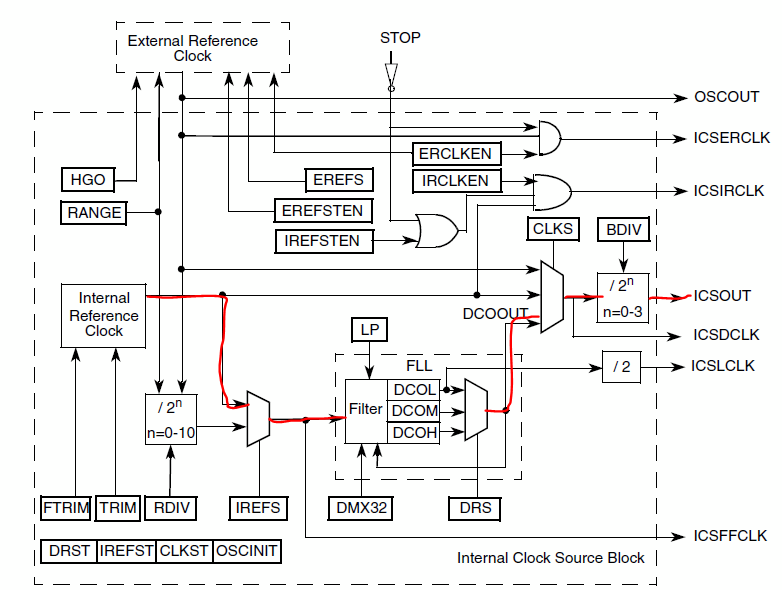
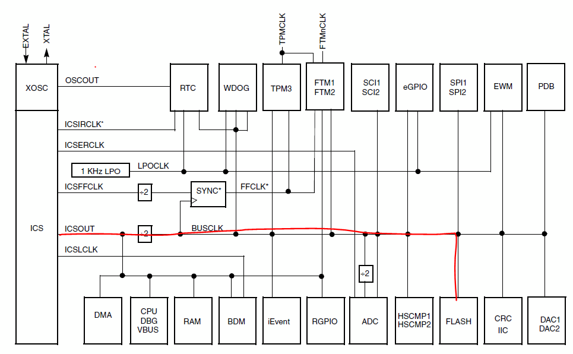
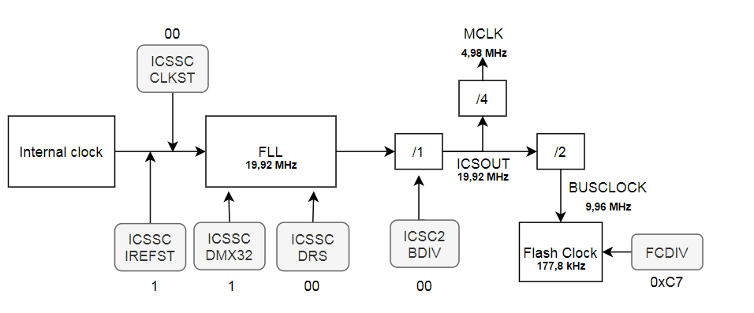

# Context

# Flash memory

### Introduction

To manipulate the flash memory (P.86) we have to configure the flash clock between 150kHz and 200kHz (P.84). <br>
Then we have to follow a specific algorithm (P.88/89) by writing registers to made a command.

### Flash clock configuration

There is the configuration path of the clock. <br>



There is the steps used to configure the flash clock with the frequency and the registers value at each steps.</br>



**BUSCLOCK**: Need to be superior than 8 MHz.<br>
**MCLK** : Physical output of the clock PIN PTA6 (P107). This output is not clearly explain is the documentation but it can be help full to verify the clock configuration.

#### Register used :
Register|Operation|Value
--------|---------|-----
ICSSC_IREFST|Choose the internal clock| 1
ICSS_CLKST|Choose the FLL|00
ICSSC_DMX32|Define the internal clock source to 32.768 kHz|1
ICSSC_DRS|Define the FLL output to 19,92MHz|00
ICSC2_BDIV|The FLL output is not divided|00
FCDIV|The BUSCLOCK is divided by 56| 0xC7

#### Code used :

````C
	// Reference Internal clock configuration
	ICSSC_DRST_DRS=0;
	ICSSC_DMX32=1;
	ICSSC_IREFST =1;
	ICSSC_CLKST1 = 0;
	ICSSC_CLKST0 = 0;
	ICSSC_OSCINIT = 0;
	ICSSC_FTRIM = 0;	
	
	ICSC1_CLKS1 = 0;
	ICSC1_CLKS0 = 0;
	ICSC1_RDIV2 = 1;
	ICSC1_RDIV1 = 0;
	ICSC1_RDIV0 = 0;
	ICSC1_IREFS = 1;
	ICSC1_IRCLKEN = 0;
	ICSC1_IREFSTEN = 0;

	// BDIV Configuration
	ICSC2_BDIV1 = 0;
	ICSC2_BDIV0 = 0;
	ICSC2_RANGE = 1;
	ICSC2_HGO = 0;
	ICSC2_LP = 0;
	ICSC2_EREFS = 1; /* => Oscillator requested */
	ICSC2_ERCLKEN = 0;
	ICSC2_EREFSTEN = 0;
	
	// Flash clock
	FCDIV_FDIVLD = 1;
	FCDIV_PRDIV8 = 1;
	FCDIV_FDIV = 0x7; 
````

### Flash program

The following program is made by using the algorithm P.88/89 <br>
The program write the value 0x633F67E to the 0x8004 address.

Unfortunately, the program don't work each time.

````C
// Declaration
unsigned long *pdst;

// Flash program
	if (FCDIV_FDIVLD){
		FSTAT_FCBEF = 1;
		if (FSTAT_FCBEF == 1){
			if(!FSTAT_FPVIOL && !FSTAT_FACCERR){
				pdst=(unsigned long *)0x8004;
				*pdst = 0x633F67E;
				FCMD = 0x20; 
				FSTAT = 0x80;
				while (!FSTAT_FCCF){}
			}
		}
	}

````