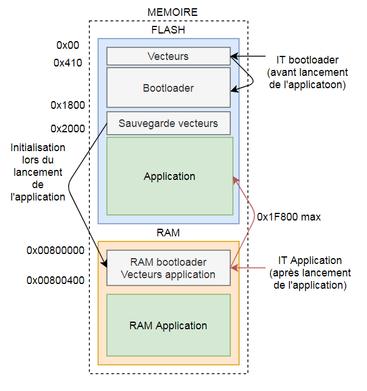
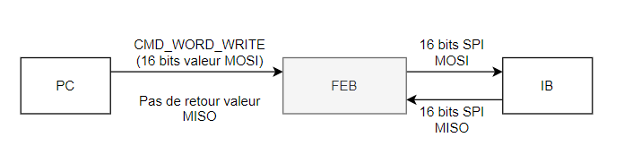
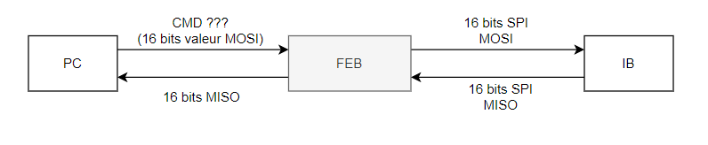

> All the references made are from MCF51AG128RM.pdf

<!--
[**1. Context**](#1) <br>
[**2. Bootloader**](#2) <br>
[a. General Algorithm](#2.1) <br>
[b.	Memory organisation](#2.2) <br>
[c.	Jump address](#2.3) <br>
[d. SPI frames](#2.4) <br>
[e. SPI commands](#2.5) <br>
[f. SPI Algorithm](#2.6) <br>
[**3. Flash memory**](#3) <br>
[a. Introduction](#3.1) <br>
[b. Flash clock configuration](#3.2) <br>
[c. Flash fuctions](#3.3) <br>
[d. Flash memory protection](#3.4) <br>
[**4. User Manual**](#4) <br>
[a. Build the program using CodeWarrior](#4.1) <br>
[b. Flash the program with a Rasberry Pie](#4.2) <br>
-->           

# Bootloader V3.0

Cette version du bootloader permet d'écrire une application dans la memoire flash au travers du SPI avec contrôle des paquets.
Le protocole de communication mis en place s’appuie sur le S19.

Améliorations par rapport a la version V2.2:
- Changement du protocole de communication et des commandes reseaux
- Modification de l'algorithme pour s'adapter aux nouvelles commandes reseaux
- Protection de la memoire flash (Bootloader + Vecteurs application)
- Amelioration des codes status

Améliorations par rapport a la version V2.0:
- Sauvegarde des vecteurs dans la memoire flash
- Chargement des vecteurs à chaque lancement de l'application


### I - Protocole de communication

#### 1. Commandes et status

Commandes :<br>
300 : Write <br>
310 : Read status <br>
330 : Read checksum <br>
500 : Effacer la memoire <br>
700 : Lancer le programme <br>

Status : <br>
30 : Vous avez la main sur le bootloader. Prêt a lancer l'application ou Jumper <br>
20 : Occupé (En train d'écrire ou en train d’effacer) <br>
10 : En processus de flash, prêt a continuer <br>
5 : Erreur lors de l'écriture : zone memoire protege

#### 2. Protocole d'écriture

<center>

</center>

### II - Organisation de la memoire


<center>

</center>

### III - Flasher SPI

### IV - Communication au travers de la FEB

<center>

</center>
<center>

</center>

### V - Checksum

## Manuel utilisateur

### I - Compiler une application avec CodeWarrior compatible avec le bootloader

Pour que l'application soit compatible avec le bootloader, il faut effectuer 3 modification avant la compilation :
- Changement du registre VBR qui redirige les vecteurs dans la memoire RAM
- Modifier l'origine et la taille de la memoire flash et RAM de l'application
- Modifier l'emplacement des vecteurs

#### 1. Registre VBR

Vous devez ajouter les deux lignes de code ci-dessous dans le fichier suivant (a partir de la ligne 191) :
Project_Setting > Startup_Code > startcf.c

!{width:50%}Code_VBR.PNG!

#### 2. Modification origine et taille de la memoire

Vous devez modifier la taille des memoires dans le fichier ci-dessous :
Project_Setting > Linker_Files > Project.lcf

Les deux lignes a modifier se trouvent lignes 6 et 7 du fichier a l'emplacement suivant :
!{width:50%}Memory_configuration2.PNG!

Vous devez remplacer la taille des memoires par les tailles suivantes :
````C
   code        (RX)  : ORIGIN = 0x00002000, LENGTH = 0x0001E000
   userram     (RWX) : ORIGIN = 0x00800400, LENGTH = 0x00003C00
````

#### 3. Modification de l'emplacement des vecteurs

Remplacer l'emplacement des vecteurs par le code suivant (de la ligne 176 à 290) :
Project_Headers > mcf51ag128.h

````C
/**************** interrupt vector table ****************/
#define INITSP                          0x800000U
#define INITPC                          0x800004U
#define Vaccerr                         0x800008U
#define Vadderr                         0x80000CU
#define Viinstr                         0x800010U
#define VReserved5                      0x800014U
#define VReserved6                      0x800018U
#define VReserved7                      0x80001CU
#define Vprviol                         0x800020U
#define Vtrace                          0x800024U
#define Vunilaop                        0x800028U
#define Vunilfop                        0x80002CU
#define Vdbgi                           0x800030U
#define VReserved13                     0x800034U
#define Vferror                         0x800038U
#define VReserved15                     0x80003CU
#define VReserved16                     0x800040U
#define VReserved17                     0x800044U
#define VReserved18                     0x800048U
#define VReserved19                     0x80004CU
#define VReserved20                     0x800050U
#define VReserved21                     0x800054U
#define VReserved22                     0x800058U
#define VReserved23                     0x80005CU
#define Vspuri                          0x800060U
#define VReserved25                     0x800064U
#define VReserved26                     0x800068U
#define VReserved27                     0x80006CU
#define VReserved28                     0x800070U
#define VReserved29                     0x800074U
#define VReserved30                     0x800078U
#define VReserved31                     0x80007CU
#define Vtrap0                          0x800080U
#define Vtrap1                          0x800084U
#define Vtrap2                          0x800088U
#define Vtrap3                          0x80008CU
#define Vtrap4                          0x800090U
#define Vtrap5                          0x800094U
#define Vtrap6                          0x800098U
#define Vtrap7                          0x80009CU
#define Vtrap8                          0x8000A0U
#define Vtrap9                          0x8000A4U
#define Vtrap10                         0x8000A8U
#define Vtrap11                         0x8000ACU
#define Vtrap12                         0x8000B0U
#define Vtrap13                         0x8000B4U
#define Vtrap14                         0x8000B8U
#define Vtrap15                         0x8000BCU
#define VReserved48                     0x8000C0U
#define VReserved49                     0x8000C4U
#define VReserved50                     0x8000C8U
#define VReserved51                     0x8000CCU
#define VReserved52                     0x8000D0U
#define VReserved53                     0x8000D4U
#define VReserved54                     0x8000D8U
#define VReserved55                     0x8000DCU
#define VReserved56                     0x8000E0U
#define VReserved57                     0x8000E4U
#define VReserved58                     0x8000E8U
#define VReserved59                     0x8000ECU
#define VReserved60                     0x8000F0U
#define Vunsinstr                       0x8000F4U
#define VReserved62                     0x8000F8U
#define VReserved63                     0x8000FCU
#define Virq                            0x800100U
#define Vlvd                            0x800104U
#define VReserved66                     0x800108U
#define VReserved67                     0x80010CU
#define Vdmach0                         0x800110U
#define Vdmach1                         0x800114U
#define Vdmach2                         0x800118U
#define Vdmach3                         0x80011CU
#define Vieventch0                      0x800120U
#define Vftm1fault_ovf                  0x800124U
#define Vftm1ch0                        0x800128U
#define Vftm1ch1                        0x80012CU
#define Vftm1ch2                        0x800130U
#define Vftm1ch3                        0x800134U
#define Vftm1ch4                        0x800138U
#define Vftm1ch5                        0x80013CU
#define Vftm2fault_ovf                  0x800140U
#define Vftm2ch0                        0x800144U
#define Vftm2ch1                        0x800148U
#define Vftm2ch2                        0x80014CU
#define Vftm2ch3                        0x800150U
#define Vftm2ch4                        0x800154U
#define Vftm2ch5                        0x800158U
#define Vtpm3ovf                        0x80015CU
#define Vtpm3ch0                        0x800160U
#define Vtpm3ch1                        0x800164U
#define Vadc                            0x800168U
#define Vhscmp1                         0x80016CU
#define Vhscmp2                         0x800170U
#define Vieventch1                      0x800174U
#define Vspi1                           0x800178U
#define Vspi2                           0x80017CU 
#define Vsci1err                        0x800180U
#define Vsci1rx                         0x800184U
#define Vsci1tx                         0x800188U
#define Viic                            0x80018CU
#define Vieventch2                      0x800190U
#define Vsci2err                        0x800194U
#define Vsci2rx                         0x800198U
#define VL7swi                          0x80019CU
#define VL6swi                          0x8001A0U
#define VL5swi                          0x8001A4U
#define VL4swi                          0x8001A8U
#define VL3swi                          0x8001ACU
#define VL2swi                          0x8001B0U
#define VL1swi                          0x8001B4U
#define Vsci2tx                         0x8001B8U
#define Vportae                         0x8001BCU
#define Vportfj                         0x8001C0U
#define Vrtc_wdg                        0x8001C4U
#define Vieventch3                      0x8001C8U
````

# Annexes

## Flash memory <a id="3"></a>

### Introduction <a id="3.1"></a>

To manipulate the flash memory (P.86) we have to configure the flash clock between 150kHz and 200kHz (P.84). <br>
Then we have to follow a specific algorithm (P.88/89) by writing registers to made a command.

### Flash clock configuration <a id="3.2"></a>

There is the configuration path of the clock. <br>
<center>

</center>
<center>

</center>

There is the steps used to configure the flash clock with the frequency and the registers value at each steps.</br>


**BUSCLOCK**: Need to be superior than 8 MHz.<br>
**MCLK** : Physical output of the clock PIN PTA6 (P107). This output is not clearly explain is the documentation but it can be help full to verify the clock configuration.

#### Register used :
Register|Operation|Value
--------|---------|-----
ICSSC_IREFST|Choose the internal clock| 1
ICSS_CLKST|Choose the FLL|00
ICSSC_DMX32|Define the internal clock source to 32.768 kHz|1
ICSSC_DRS|Define the FLL output to 39,84MHz|01
ICSC2_BDIV|The FLL output is divided by two|01
FCDIV|The BUSCLOCK is divided by 56| 0xC7

#### Code used :

````C
	// Intern clock init 
	ICSSC = 0x70;

	// Flash clock init
	FCDIV_FDIVLD = 1;
	FCDIV_PRDIV8 = 1;
	FCDIV_FDIV = 0x8; 
````

### Flash functions <a id="3.3"></a>

#### Adress error :
To solve the address error problem, you have to change the asm_exception_handler() function into the exeption.c with the following code :

````C
asm  __declspec(register_abi) void asm_exception_handler(void)
{
	addq.l		#8, sp
}
````

Functions have been made, using commands code and algorithms, to manage the flash memory.

Function | Command | Inputs
---------|---------|-------
Flash_erase| Erase the flash memory at a specific address| address : address where the flash block have to be erased
Flash_write| Write a value to a specific address | address : address where the value have to be written <br> value : value which have to be written
Flash_burst| Write a serie of value from a specific address | address : address where the program will begin to write <br> tblvalue : table of the values <br> length : length of values

#### Debug Result

The program write the value 0x633F67E to the 0x8004 address.

<center>

</center>

#### Code

````C
void Flash_burst(unsigned long address, unsigned int tblvalue[], unsigned int length){
	unsigned int i;
	unsigned long *pdst;
	
	for (i = 0; i<length; i++){
		pdst = (unsigned long *)(address + 4*i);
		FSTAT_FCBEF = 1;
		if (!FSTAT_FACCERR && !FSTAT_FPVIOL){ FSTAT = 0x30;}
		*pdst = tblvalue[i];
		FCMD = 0x25; 
		FSTAT = 0x80;
		while (!FSTAT_FCCF){}
	}
}

void Flash_write(unsigned long address, unsigned int value){
	unsigned long *pdst = (unsigned long *)address;
	FSTAT_FCBEF = 1;
	if (!FSTAT_FACCERR && !FSTAT_FPVIOL){ FSTAT = 0x30;}
	*pdst = value;
	FCMD = 0x20; 
	FSTAT = 0x80;
	while (!FSTAT_FCCF){}
}

void Flash_erase(unsigned long address ){
	unsigned long *pdst = (unsigned long *)address;
	unsigned int value = 0x54454554;
	
	FSTAT_FCBEF = 1;
	if (!FSTAT_FACCERR && !FSTAT_FPVIOL){ FSTAT = 0x30; }
	*pdst = value;
	FCMD = 0x40; 
	FSTAT = 0x80;
	while (!FSTAT_FCCF){}
}
````

### Flash protection <a id="3.4"></a>

````C
	// Exemple protection
	FPROT_FPS = 0x77; 
	FPROT_FPOPEN = 1;
````