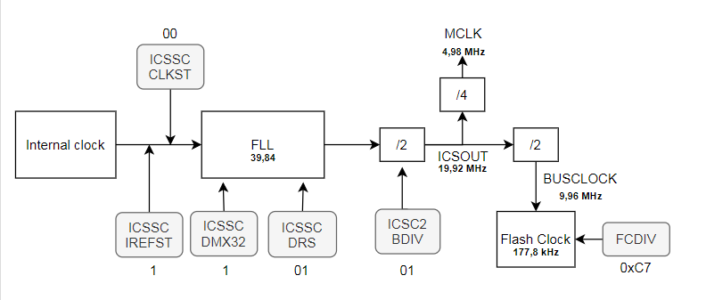

> All the references made are from MCF51AG128RM.pdf

<!--
[**1. Context**](#1) <br>
[**2. Bootloader**](#2) <br>
[a. General Algorithm](#2.1) <br>
[b.	Memory organisation](#2.2) <br>
[c.	Jump address](#2.3) <br>
[d. SPI frames](#2.4) <br>
[e. SPI commands](#2.5) <br>
[f. SPI Algorithm](#2.6) <br>
[**3. Flash memory**](#3) <br>
[a. Introduction](#3.1) <br>
[b. Flash clock configuration](#3.2) <br>
[c. Flash fuctions](#3.3) <br>
[d. Flash memory protection](#3.4) <br>
[**4. User Manual**](#4) <br>
[a. Build the program using CodeWarrior](#4.1) <br>
[b. Flash the program with a Rasberry Pie](#4.2) <br>
-->           


[**I - Bootloader V4.0**](#1) <br>
[**1. Commandes**](#1.1)<br>
[**2. Flasher SPI**](#1.2)<br>
[**3. Commande réseaux FEB**](#1.3)<br>
[**4. Organisation de la memoire MCF51AG128**](#1.4)<br>
[**5. Checksum**](#1.5)<br>
[**II - Manuel Utilisateur**](#2)<br>
[**1. Utilisation du Flasher SPI**](#2.1)<br>
[**2. Compiler une application avec CodeWarrior compatible avec le bootloader**](#2.2)<br>
<br>
Documentation Technique MCF51AG128<br>
[**III. Flash memory MCF51AG128**](#3) <br>
[a. Introduction](#3.1) <br>
[b. Flash clock configuration](#3.2) <br>
[c. Flash fuctions](#3.3) <br>
[d. Flash memory protection](#3.4) <br>


# Bootloader V4.2 <a id="1"></a>

Utilisez la dernière version du Bootloader (a téléverser sur la carte avec le port BDM) :
Fichier S19 bootloader V4.2 : 

Utilisez la dernière version du Flasher SPI avec un ordinateur connecté a la FEB :
Programme python du flasher SPI : 
-> Pour l'utilisation du flasher SPI, voir plus bas dans la documentaiton

Téléversez avec le Flasher SPI la version 3 du programme IB :
Fichier S19 du programme IB V3 compatible avec les versions du bootloader supérieures a la version V3 : 
-> Pour compiler des code compatible avec le bootloader, voir plus bas dans la documentation

### 1 - Commandes<a id="1.1"></a>

Les diagrammes de séquences sont en annexe.

|**Nom** | **Commande** | **Nb de mots** | **Suite d'instructions** | **Description**|
|--------|--------------|----------------|--------------------------|----------------|
|Save_memory_sector (in RAM) | 300 |N | Command + Lenght + Address MSB + Address LSB + Word MSB[N] + Word LSB[N]|Sauvegarder un secteur de mémoire dans la mémoire RAM|
|Erase_flash_sector (1kb) | 305 |4 | Command + Address MSB + Address LSB |Effacer 1 kb de mémoire flash à partir d’une adresse donnée|
|Flash_saved_memory | 310 |1 |Command |Ecrire dans la mémoire flash le secteur mémoire préalablement sauvegardé dans la mémoire ram (avec la commande Save_memory_sector)|
|Read_memory_word | 400 |5 | Command + Address MSB + Address LSB with Read msb + Read lsb*|Lire la valeur de la mémoire à une adresse donnée|
|Read_status | 410 |2 | Command + Read*|Lire l’état du bootloader à un moment donné. Tableau décrivant les codes retours plus bas|
|Read_checksum |420 |2 | Command + Read*|Lire la checksum calculé par le microcontrôleur après avoir sauvegardé les données reçues en mémoire RAM (Save_memory_sector). La checksum permet de savoir si toutes les informations reçues par le microcontrôleur sont correctes.|
|Load_vectors|600| 1 | Command|Écrire les vecteurs sauvegardés dans la zone de la mémoire flash vers la mémoire RAM. Cette commande doit être appelé avant le lancement de l’application|
|Jump_to_specific_address | 700 |3 | Command + Address MSB + Address LSB|Permet d’exécuter le programme du microcontrôleur à une adresse donnée. Une fois que le programme a été écrit dans la mémoire flash, il faut le lancer en faisant un “Jump” à la bonne adresse|
|Jump_to_application|710 |1|Command| Jump pour lancer l'application à partir de l'adresse de startup stocké à l'address 0x1FF0 (Stocké dans la zone après les vecteurs et contenu dans la zone de protection entre 0x1800 et 0x2000) Si aucune valeur n'est stocké (valeur 0xFFFFFFF) alors aucune action n'est effectué. Un "check status" peut être effectué après le lancement pour savoir seumlement si il y a une erreur, (Si l'application est bien lancé il n'y a plus la main sur le bootloader), sinon il envoie le code d'erreur "7" La valeur à l'addresse 0x1FF0 est effacé a chaque lancement de processus de reflash du microcontroleur|

*N'importe quelle valeur possible car c'est la valeur lu qui va être importante.

**300 - Save_memory_sector (in RAM)**

Cette commande permet de sauvegarder un secteur de mémoire dans un tableau (memoire RAM).
La commande est prévus pour effectuer par la suite une inscription dans la mémoire FLASH.
A chaque inscription, la cheksum est calculée.

Elle fonctionne avec la suite d'instruction suivante :
- Envoie de la commande 300
- Envoie du nombre de mot de 32 bits a sauvegarder
- Envoie de la valeur de l'adresse a partir de l'aquelle les valeurs vont être inscrites dans la mémoire FLASH
- Envoie des valeurs jusqu'a ce que le nombre de mot attendu est atteint

**305 - Erase_flash_sector (1kb)**

Cette commande efface 1kb la mémoire flash a partir d'une addresse donnée.

Elle fonctionne avec la suite d'instruction suivante :
- Envoie de la commande 305
- Envoie de l'adresse de début de l'éffacement 

**310 - Flash_saved_memory**

Cette commande permet d'écrire en mémoire FLASH les valeurs sauvegardés par la commande 300.

Il faut envoyer la commande 310.

**400 - Read_memory_word** 

Cette commande permet de lire une valeur de la mémoire à partir d'une addresse donnée.

Voici la suite d'instruction :
- Envoie de la commande 400
- Envoie de l'addresse MSB
- Envoie de l'address LSB permettant de lire en même temps la valeur MSB de l'address
- Envoie de la commande 400 permettant de lire la valeur LSB de l'addresse

**410 - Read_status**

Cette commande permet de connaitre l'état du microcontroleur au démarrage ou après une commande

Codes retour de la commande "Check status" :
|**Valeur**|**Description**|
|30|Le bootloader est bien lancé, aucune commande n'a été effectué|
|20|Le microcontroleur est occupé a effectuer une commande|
|10|Le microcontroleur à bien effectué la dernière commande|
|7| Une demande de lancement de l'application ("Jump_to_application") a été lancé mais a retourné une erreur |
|5|La denière commande demandé a retourne une erreur|

Voici la suite d'instruction :
- Envoie de la commande 410
- Envoie de la commande 410 permettant la lecture du code retour

**h4. 420 - Read_checksum** 

Cette commande permet de lire la checksum calculé a partir des données envoyés avec la commande 300.
* Informations complémentaire sur le calcul de la checksum partie 6.

Voici la suite d'instruction :
- Envoie de la commande 420
- Envoide la commande 420 pour permettre la lecture de la checksum

**600 - Load_vectors**

Cette commande permet de charger les vecteurs contenus dans la mémoire FLASH en mémoire RAM.
Cette commande est réquise avant le lancement d'une application car l'application utilise les vecteurs contenus en RAM.
* Informations complémentaire dans la Partie 4 sur l'organisation de la mémorie.

Il faut envoyer la commande 600.

**700 - Jump_to_specific_address** 

Cette commande permet d'effectuer un JUMP à un adresse voulu dans la mémoire.
Cette commande n'a pas besoin d'être utilisé pour le lancement de l'application (Commande 710 plus pertinente), elle a été prevu pour le développement du bootloader et éventuellement pour du débuggage futur.

Voici la suite d'instruction :
- Envoie de la commande 700
- Envoie de l'adresse de JUMP

**710 - Jump_to_application**

Cette commande permet de lancer l'application.
La valeur de l'addresse de "_startup" de l'application est stocké à l'address 0x1FF0 (Stocké dans la zone après les vecteurs et contenu dans la zone de protection entre 0x1800 et 0x2000).
Si aucune valeur n'est stocké (valeur 0xFFFFFFF) alors aucune action n'est effectué.
Un "check status" peut être effectué après le lancement pour savoir seulement si il y a une erreur,
(Si l'application est bien lancé il n'y a plus la main sur le bootloader), sinon il envoie le code d'erreur "7"
La valeur à l'addresse 0x1FF0 est effacé a chaque lancement de processus de reflash du microcontroleur.
*Voir informations complémentaires partie 5 sur le JUMP et lancement de l'application.

### 2 - Flasher SPI<a id="1.2"></a>

Le flasher permet de reprogrammer la carte IB avec un ordinateur connecté en réseau avec la FEB.
*Voir utilisation du flasher partie manuel utilisateur

Voici le visuel du Flasher SPI V4.2 :


Dans un premier temps le Flasher s’assure que le bootloader est bien connecté et disponible pour envoyer des données.
Si le bootloader est opérationnel, le Flasher efface la zone mémoire dédiée à l’application, cette pratique est conseillée dans la documentation avant tout écriture dans la mémoire flash.
Le Flasher envoie ensuite les données mémoires au bootloader et commande leur écriture dans la mémoire flash après vérification de la checksum. Une fois l’opération commandée, le Flasher s’assure que le bootloader a bien terminé son écriture en mémoire et recommence cette opération jusqu'à la fin du fichier S19.
A la fin de l'écriture dans la mémoire flash, l'adresse de lancement est enregistré à l'adresse 0x1FF0.
A chaque opération, le flasher SPI effectue une commande "Check Status" pour vérifier le bon déroulement du reflash.


*La commande "JUMP to application" n'est pas présente dans ce diagramme de séquence pour lancer l'application après le reflash.


### 3 - Commande réseaux FEB<a id="1.3"></a>

Voici la trame utilisée pour envoyer et recevoir un mot de 16 bits en SPI :

|**Header** | **Commande** | **Mot SPI** |**Trailer** |
|-----------|--------------|-------------|------------|
|aaaaaaaa |C0CC0000A7400141 | XXXXXXXX | aaaaaaaa |

Voici la trame utilisé pour envoyer un mot de 16 bits en SPI (sans retour du MISO) :

|*Header* | *Commande* | *Mot SPI* |*Trailer* |
|-----------|--------------|-------------|------------|
|aaaaaaaa |C0CC000087300101| XXXXXXXX | aaaaaaaa |

### 4 - Organisation de la memoire<a id="1.4"></a>

Lors de la réception des paquets de données le bootloader organise la mémoire.
La mémoire flash contient deux programmes :
- Le bootloader (code figé)
- L’application (code pouvant être reflashé)

L’application est dans une partie décalé de la mémoire flash par rapport au bootloader. Le programme est lancé en faisant un “jump” au niveau de l’application.

Lorsque le microcontrôleur reçoit une interruption (par exemple la réception d’un message SPI) les vecteurs vont pointer dans la partie de la mémoire associée. Mais il n’est pas possible de modifier la place des vecteurs ou de les remplacer (les vecteurs étant utiles au bootloader pour son bon fonctionnement). 
Une option du microcontrôleur permet de regarder l’emplacement des vecteurs au niveau de la mémoire RAM.
La mémoire RAM étant volatile, la stratégie utilisée a été de sauvegarder la valeur des vecteurs dans un emplacement de la mémoire Flash et de les placer en RAM à chaque lancement. Lors du lancement de l'application, le registre qui pointe l’emplacement des vecteurs est modifié pour pointer les vecteurs non pas au début de la mémoire flash mais au début de la mémoire RAM.
Voici l’organisation de la mémoire du microcontrôleur :

<center>

</center>

### 5 - Checksum<a id="1.5"></a>

<pre><code class="c">
int chcksum(struct ShortBits value){
	int ck = 0;
	if (value.bit0 == 1) { ck += 1;}
	if (value.bit1 == 1) { ck += 1;}
	if (value.bit2 == 1) { ck += 1;}
	if (value.bit3 == 1) { ck += 1;}
	if (value.bit4 == 1) { ck += 1;}
	if (value.bit5 == 1) { ck += 1;}
	if (value.bit6 == 1) { ck += 1;}
	if (value.bit7 == 1) { ck += 1;}
	if (value.bit8 == 1) { ck += 1;}
	if (value.bit9 == 1) { ck += 1;}
	if (value.bit10 == 1) { ck += 1;}
	if (value.bit11 == 1) { ck += 1;}
	if (value.bit12 == 1) { ck += 1;}
	if (value.bit13 == 1) { ck += 1;}
	if (value.bit14 == 1) { ck += 1;}
	if (value.bit15 == 1) { ck += 1;}
	
	return ck;
}
</code></pre>


Calcul de la checksum au niveau du Flasher (Python 3):
<pre><code class="python">
    def chcksum(self,value) :
        ck = 0
        table = [int(x) for x in bin(value)[2:]]
        for i in range (len(table)) :
            if table[i] == 1 :
                ck += 1
        return ck 
</code></pre>

## Manuel utilisateur

### I - Utilisation du Flasher SPI <a id="2.1"></a>

> Vous devez avoir une version de python 3

Si PyQt5 n'est pas installé sur votre ordianteur :
````console
$ pip3 install PyQt5
````

Lancer l'application :
````console
$ python3 SPI_FasherV4_FEB.py
````
<br>


Une fois lancé, selectionnez le fichier S19 compatible avec le bootloader en cliquant sur "Select File".
Pour voir comment compiler un programme compatible avec le bootloader, referez vous au chapitre suivant.

> Attention ! Avant de lancer le reflash de la carte votre FEB doit être initialisé. 
> Cependant toute application communiquant avec la FEB comme qNectarCam doivent être fermés.


Lancez le reflash de la carte en cliquant sur "Flash memory".
Une barre de progression va se lancer et les boutons ne seront plus accessible pour eviter toute erreur.

Lorsque la barre affiche "Successful" vous pourrez appuyer sur "Lauch program" pour lancer l'application.


### II - Compiler une application avec CodeWarrior compatible avec le bootloader<a id="2.2"></a>

Pour que l'application soit compatible avec le bootloader, il faut effectuer 3 modification avant la compilation :
- Changement du registre VBR qui redirige les vecteurs dans la memoire RAM
- Modifier l'origine et la taille de la memoire flash et RAM de l'application
- Modifier l'emplacement des vecteurs

#### 1. Registre VBR

Vous devez ajouter les deux lignes de code ci-dessous dans le fichier suivant (a partir de la ligne 191) :
Project_Setting > Startup_Code > startcf.c


#### 2. Modification origine et taille de la memoire

Vous devez modifier la taille des memoires dans le fichier ci-dessous :
Project_Setting > Linker_Files > Project.lcf

Les deux lignes a modifier se trouvent lignes 6 et 7 du fichier a l'emplacement suivant : <bR>
````C
   code        (RX)  : ORIGIN = 0x00002000, LENGTH = 0x0001E000
   userram     (RWX) : ORIGIN = 0x00800400, LENGTH = 0x00003C00
````

#### 3. Modification de l'emplacement des vecteurs

Remplacer l'emplacement des vecteurs par le code suivant (de la ligne 176 à 290) :
Project_Headers > mcf51ag128.h

````C
/**************** interrupt vector table ****************/
#define INITSP                          0x800000U
#define INITPC                          0x800004U
#define Vaccerr                         0x800008U
#define Vadderr                         0x80000CU
#define Viinstr                         0x800010U
#define VReserved5                      0x800014U
#define VReserved6                      0x800018U
#define VReserved7                      0x80001CU
#define Vprviol                         0x800020U
#define Vtrace                          0x800024U
#define Vunilaop                        0x800028U
#define Vunilfop                        0x80002CU
#define Vdbgi                           0x800030U
#define VReserved13                     0x800034U
#define Vferror                         0x800038U
#define VReserved15                     0x80003CU
#define VReserved16                     0x800040U
#define VReserved17                     0x800044U
#define VReserved18                     0x800048U
#define VReserved19                     0x80004CU
#define VReserved20                     0x800050U
#define VReserved21                     0x800054U
#define VReserved22                     0x800058U
#define VReserved23                     0x80005CU
#define Vspuri                          0x800060U
#define VReserved25                     0x800064U
#define VReserved26                     0x800068U
#define VReserved27                     0x80006CU
#define VReserved28                     0x800070U
#define VReserved29                     0x800074U
#define VReserved30                     0x800078U
#define VReserved31                     0x80007CU
#define Vtrap0                          0x800080U
#define Vtrap1                          0x800084U
#define Vtrap2                          0x800088U
#define Vtrap3                          0x80008CU
#define Vtrap4                          0x800090U
#define Vtrap5                          0x800094U
#define Vtrap6                          0x800098U
#define Vtrap7                          0x80009CU
#define Vtrap8                          0x8000A0U
#define Vtrap9                          0x8000A4U
#define Vtrap10                         0x8000A8U
#define Vtrap11                         0x8000ACU
#define Vtrap12                         0x8000B0U
#define Vtrap13                         0x8000B4U
#define Vtrap14                         0x8000B8U
#define Vtrap15                         0x8000BCU
#define VReserved48                     0x8000C0U
#define VReserved49                     0x8000C4U
#define VReserved50                     0x8000C8U
#define VReserved51                     0x8000CCU
#define VReserved52                     0x8000D0U
#define VReserved53                     0x8000D4U
#define VReserved54                     0x8000D8U
#define VReserved55                     0x8000DCU
#define VReserved56                     0x8000E0U
#define VReserved57                     0x8000E4U
#define VReserved58                     0x8000E8U
#define VReserved59                     0x8000ECU
#define VReserved60                     0x8000F0U
#define Vunsinstr                       0x8000F4U
#define VReserved62                     0x8000F8U
#define VReserved63                     0x8000FCU
#define Virq                            0x800100U
#define Vlvd                            0x800104U
#define VReserved66                     0x800108U
#define VReserved67                     0x80010CU
#define Vdmach0                         0x800110U
#define Vdmach1                         0x800114U
#define Vdmach2                         0x800118U
#define Vdmach3                         0x80011CU
#define Vieventch0                      0x800120U
#define Vftm1fault_ovf                  0x800124U
#define Vftm1ch0                        0x800128U
#define Vftm1ch1                        0x80012CU
#define Vftm1ch2                        0x800130U
#define Vftm1ch3                        0x800134U
#define Vftm1ch4                        0x800138U
#define Vftm1ch5                        0x80013CU
#define Vftm2fault_ovf                  0x800140U
#define Vftm2ch0                        0x800144U
#define Vftm2ch1                        0x800148U
#define Vftm2ch2                        0x80014CU
#define Vftm2ch3                        0x800150U
#define Vftm2ch4                        0x800154U
#define Vftm2ch5                        0x800158U
#define Vtpm3ovf                        0x80015CU
#define Vtpm3ch0                        0x800160U
#define Vtpm3ch1                        0x800164U
#define Vadc                            0x800168U
#define Vhscmp1                         0x80016CU
#define Vhscmp2                         0x800170U
#define Vieventch1                      0x800174U
#define Vspi1                           0x800178U
#define Vspi2                           0x80017CU 
#define Vsci1err                        0x800180U
#define Vsci1rx                         0x800184U
#define Vsci1tx                         0x800188U
#define Viic                            0x80018CU
#define Vieventch2                      0x800190U
#define Vsci2err                        0x800194U
#define Vsci2rx                         0x800198U
#define VL7swi                          0x80019CU
#define VL6swi                          0x8001A0U
#define VL5swi                          0x8001A4U
#define VL4swi                          0x8001A8U
#define VL3swi                          0x8001ACU
#define VL2swi                          0x8001B0U
#define VL1swi                          0x8001B4U
#define Vsci2tx                         0x8001B8U
#define Vportae                         0x8001BCU
#define Vportfj                         0x8001C0U
#define Vrtc_wdg                        0x8001C4U
#define Vieventch3                      0x8001C8U
````

# Documentation technique MCF51AG128

## Flash memory <a id="3"></a>

### Introduction <a id="3.1"></a>

To manipulate the flash memory (P.86) we have to configure the flash clock between 150kHz and 200kHz (P.84). <br>
Then we have to follow a specific algorithm (P.88/89) by writing registers to made a command.

### Flash clock configuration <a id="3.2"></a>

There is the configuration path of the clock. <br>
<center>

</center>
<center>

</center>

There is the steps used to configure the flash clock with the frequency and the registers value at each steps.</br>



**BUSCLOCK**: Need to be superior than 8 MHz.<br>
**MCLK** : Physical output of the clock PIN PTA6 (P107). This output is not clearly explain is the documentation but it can be help full to verify the clock configuration.

#### Register used :
Register|Operation|Value
--------|---------|-----
ICSSC_IREFST|Choose the internal clock| 1
ICSS_CLKST|Choose the FLL|00
ICSSC_DMX32|Define the internal clock source to 32.768 kHz|1
ICSSC_DRS|Define the FLL output to 39,84MHz|01
ICSC2_BDIV|The FLL output is divided by two|01
FCDIV|The BUSCLOCK is divided by 56| 0xC7

#### Code used :

````C
	// Intern clock init 
	ICSSC = 0x70;

	// Flash clock init
	FCDIV_FDIVLD = 1;
	FCDIV_PRDIV8 = 1;
	FCDIV_FDIV = 0x8; 
````

### Flash functions <a id="3.3"></a>

#### Adress error :
To solve the address error problem, you have to change the asm_exception_handler() function into the exeption.c with the following code :

````C
asm  __declspec(register_abi) void asm_exception_handler(void)
{
	addq.l		#8, sp
}
````

Functions have been made, using commands code and algorithms, to manage the flash memory.

Function | Command | Inputs
---------|---------|-------
Flash_erase| Erase the flash memory at a specific address| address : address where the flash block have to be erased
Flash_write| Write a value to a specific address | address : address where the value have to be written <br> value : value which have to be written
Flash_burst| Write a serie of value from a specific address | address : address where the program will begin to write <br> tblvalue : table of the values <br> length : length of values

#### Debug Result

The program write the value 0x633F67E to the 0x8004 address.

<center>

</center>

#### Code

````C
void Flash_burst(unsigned long address, unsigned int tblvalue[], unsigned int length){
	unsigned int i;
	unsigned long *pdst;
	
	for (i = 0; i<length; i++){
		pdst = (unsigned long *)(address + 4*i);
		FSTAT_FCBEF = 1;
		if (!FSTAT_FACCERR && !FSTAT_FPVIOL){ FSTAT = 0x30;}
		*pdst = tblvalue[i];
		FCMD = 0x25; 
		FSTAT = 0x80;
		while (!FSTAT_FCCF){}
	}
}

void Flash_write(unsigned long address, unsigned int value){
	unsigned long *pdst = (unsigned long *)address;
	FSTAT_FCBEF = 1;
	if (!FSTAT_FACCERR && !FSTAT_FPVIOL){ FSTAT = 0x30;}
	*pdst = value;
	FCMD = 0x20; 
	FSTAT = 0x80;
	while (!FSTAT_FCCF){}
}

void Flash_erase(unsigned long address ){
	unsigned long *pdst = (unsigned long *)address;
	unsigned int value = 0x54454554;
	
	FSTAT_FCBEF = 1;
	if (!FSTAT_FACCERR && !FSTAT_FPVIOL){ FSTAT = 0x30; }
	*pdst = value;
	FCMD = 0x40; 
	FSTAT = 0x80;
	while (!FSTAT_FCCF){}
}
````

### Flash protection <a id="3.4"></a>

````C
	// Exemple protection
	FPROT_FPS = 0x77; 
	FPROT_FPOPEN = 1;
````

# Annexes

## Diagrammes de séquences : Commandes


