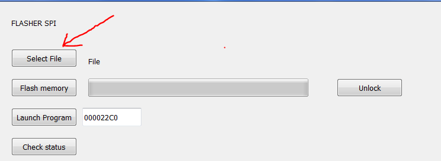
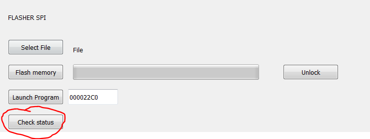
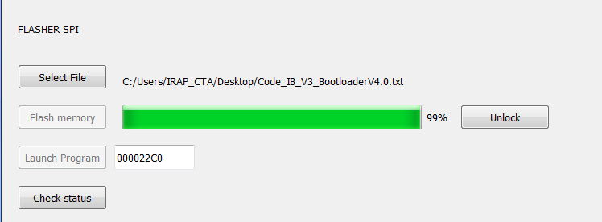
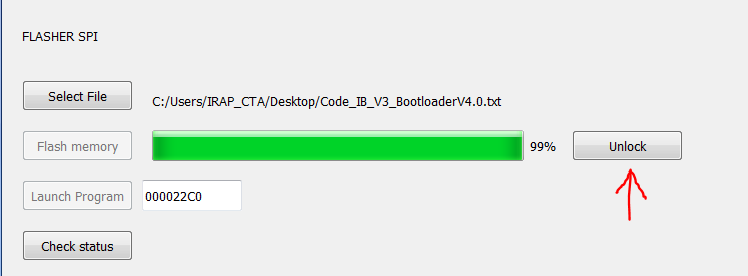
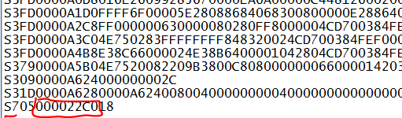
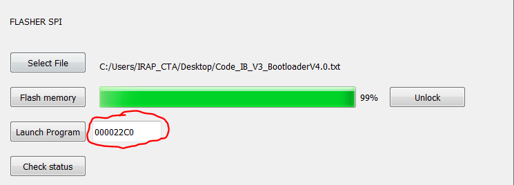

> All the references made are from MCF51AG128RM.pdf

<!--
[**1. Context**](#1) <br>
[**2. Bootloader**](#2) <br>
[a. General Algorithm](#2.1) <br>
[b.	Memory organisation](#2.2) <br>
[c.	Jump address](#2.3) <br>
[d. SPI frames](#2.4) <br>
[e. SPI commands](#2.5) <br>
[f. SPI Algorithm](#2.6) <br>
[**3. Flash memory**](#3) <br>
[a. Introduction](#3.1) <br>
[b. Flash clock configuration](#3.2) <br>
[c. Flash fuctions](#3.3) <br>
[d. Flash memory protection](#3.4) <br>
[**4. User Manual**](#4) <br>
[a. Build the program using CodeWarrior](#4.1) <br>
[b. Flash the program with a Rasberry Pie](#4.2) <br>
-->           


[**I - Bootloader V4.0**](#1) <br>
[**1. Commandes**](#1.1)<br>
[**2. Flasher SPI**](#1.2)<br>
[**3. Commande réseaux FEB**](#1.3)<br>
[**4. Organisation de la memoire MCF51AG128**](#1.4)<br>
[**5. Checksum**](#1.5)<br>
[**II - Manuel Utilisateur**](#2)<br>
[**1. Utilisation du Flasher SPI**](#2.1)<br>
[**2. Compiler une application avec CodeWarrior compatible avec le bootloader**](#2.2)<br>
<br>
Documentation Technique MCF51AG128<br>
[**III. Flash memory MCF51AG128**](#3) <br>
[a. Introduction](#3.1) <br>
[b. Flash clock configuration](#3.2) <br>
[c. Flash fuctions](#3.3) <br>
[d. Flash memory protection](#3.4) <br>


# Bootloader V4.0 <a id="1"></a>

### 1 - Commandes<a id="1.1"></a>

Nom | Commande | Nb de mots | Description
----|--------|------------|-------------
Save_memory_sector | 300 |N | Command + Address MSB + Address LSB + Length + Word MSB[N] + Word LSB[N]
Erase_flash_sector | 305 |4 | Command + Address MSB + Address LSB + Length
Flash_memory_sector | 310 |1 |Command 
Read_memory_word | 400 |5 | Command + Address MSB + Address LSB with Read msb + Read lsb*
Read_status | 410 |2 | Command + Read*
Read_checksum |420 |2 | Command + Read*
Load_vectors|600| 1 | Command
Jump | 700 |3 | Command + Address MSB + Address LSB

*N'importe quelle valeur possible car c'est la valeur lu qui va être importante.


### 2 - Flasher SPI<a id="1.2"></a>

### 3 - Commande réseaux FEB<a id="1.3"></a>
<center>

</center>
<center>

</center>

### 4 - Organisation de la memoire<a id="1.4"></a>

<center>

</center>

### 5 - Checksum<a id="1.5"></a>

## Manuel utilisateur

### I - Utilisation du Flasher SPI <a id="2.1"></a>

> Ce protocole est dédier à linux <br>
> Vous devez avoir une version de python 3

Si PyQt5 n'est pas installé sur votre ordianteur :
````console
$ pip3 install PyQt5
````

Lancer l'application :
````console
$ python3 SPI_FasherV4_FEB.py
````
<br>

Une fois lancé, selectionnez le fichier S19 compatible avec le bootloader en cliquant sur "Select File".<br>
Pour voir comment compiler un programme compatible avec le bootloader, referez vous au chapitre suivant.



<br>

> Attention ! Avant de lancer le reflash de la carte votre FEB doit être initialisé. <br>
> Cependant toute application communiquant avec la FEB comme qNectarCam doivent être fermés.

<br>

Pour verifier que la FEB et le flasher soit bien initialisés et en communication avec l'IB, cliquez sur le bouton "Check status". <br>
Le code réponse retourné dans la console doit être "10". <br>


Lancez le reflash de la carte en cliquant sur "Flash memory".<br>
Une barre de progression vas se lancer et les boutons "Flash memory" et "Launch program" ne seront plus accessible pour evitez toute erreur.<br>
<br>
Il se peut que votre version du flasher n'affiche pas 100% mais 99% à la fin d'un reflash, 
pour être sûr que le transfert soit terminé regardez sur la console qu'il y ai le message de fin de transfert.


<br>
Message de fin de transfert sur la console : <br>

<br>
Pour lancer le programme, appuyez sur "Unlock"


Avant de lancer l'application vous devez être sûr de l'addresse de lancement.<br>
Pour la trouver vous devrez ouvrir le fichier S19 et regarder le numero d'addresse entouré en rouge a la dernière ligne.<br>
Reportez cette addresse dans la textbox au niveau de "Lauch program"



<br>

Enfin, cliquez sur "Launch Program" pour lancer l'application.

### II - Compiler une application avec CodeWarrior compatible avec le bootloader<a id="2.2"></a>

Pour que l'application soit compatible avec le bootloader, il faut effectuer 3 modification avant la compilation :
- Changement du registre VBR qui redirige les vecteurs dans la memoire RAM
- Modifier l'origine et la taille de la memoire flash et RAM de l'application
- Modifier l'emplacement des vecteurs

#### 1. Registre VBR

Vous devez ajouter les deux lignes de code ci-dessous dans le fichier suivant (a partir de la ligne 191) :
Project_Setting > Startup_Code > startcf.c


#### 2. Modification origine et taille de la memoire

Vous devez modifier la taille des memoires dans le fichier ci-dessous :
Project_Setting > Linker_Files > Project.lcf

Les deux lignes a modifier se trouvent lignes 6 et 7 du fichier a l'emplacement suivant : <bR>
````C
   code        (RX)  : ORIGIN = 0x00002000, LENGTH = 0x0001E000
   userram     (RWX) : ORIGIN = 0x00800400, LENGTH = 0x00003C00
````

#### 3. Modification de l'emplacement des vecteurs

Remplacer l'emplacement des vecteurs par le code suivant (de la ligne 176 à 290) :
Project_Headers > mcf51ag128.h

````C
/**************** interrupt vector table ****************/
#define INITSP                          0x800000U
#define INITPC                          0x800004U
#define Vaccerr                         0x800008U
#define Vadderr                         0x80000CU
#define Viinstr                         0x800010U
#define VReserved5                      0x800014U
#define VReserved6                      0x800018U
#define VReserved7                      0x80001CU
#define Vprviol                         0x800020U
#define Vtrace                          0x800024U
#define Vunilaop                        0x800028U
#define Vunilfop                        0x80002CU
#define Vdbgi                           0x800030U
#define VReserved13                     0x800034U
#define Vferror                         0x800038U
#define VReserved15                     0x80003CU
#define VReserved16                     0x800040U
#define VReserved17                     0x800044U
#define VReserved18                     0x800048U
#define VReserved19                     0x80004CU
#define VReserved20                     0x800050U
#define VReserved21                     0x800054U
#define VReserved22                     0x800058U
#define VReserved23                     0x80005CU
#define Vspuri                          0x800060U
#define VReserved25                     0x800064U
#define VReserved26                     0x800068U
#define VReserved27                     0x80006CU
#define VReserved28                     0x800070U
#define VReserved29                     0x800074U
#define VReserved30                     0x800078U
#define VReserved31                     0x80007CU
#define Vtrap0                          0x800080U
#define Vtrap1                          0x800084U
#define Vtrap2                          0x800088U
#define Vtrap3                          0x80008CU
#define Vtrap4                          0x800090U
#define Vtrap5                          0x800094U
#define Vtrap6                          0x800098U
#define Vtrap7                          0x80009CU
#define Vtrap8                          0x8000A0U
#define Vtrap9                          0x8000A4U
#define Vtrap10                         0x8000A8U
#define Vtrap11                         0x8000ACU
#define Vtrap12                         0x8000B0U
#define Vtrap13                         0x8000B4U
#define Vtrap14                         0x8000B8U
#define Vtrap15                         0x8000BCU
#define VReserved48                     0x8000C0U
#define VReserved49                     0x8000C4U
#define VReserved50                     0x8000C8U
#define VReserved51                     0x8000CCU
#define VReserved52                     0x8000D0U
#define VReserved53                     0x8000D4U
#define VReserved54                     0x8000D8U
#define VReserved55                     0x8000DCU
#define VReserved56                     0x8000E0U
#define VReserved57                     0x8000E4U
#define VReserved58                     0x8000E8U
#define VReserved59                     0x8000ECU
#define VReserved60                     0x8000F0U
#define Vunsinstr                       0x8000F4U
#define VReserved62                     0x8000F8U
#define VReserved63                     0x8000FCU
#define Virq                            0x800100U
#define Vlvd                            0x800104U
#define VReserved66                     0x800108U
#define VReserved67                     0x80010CU
#define Vdmach0                         0x800110U
#define Vdmach1                         0x800114U
#define Vdmach2                         0x800118U
#define Vdmach3                         0x80011CU
#define Vieventch0                      0x800120U
#define Vftm1fault_ovf                  0x800124U
#define Vftm1ch0                        0x800128U
#define Vftm1ch1                        0x80012CU
#define Vftm1ch2                        0x800130U
#define Vftm1ch3                        0x800134U
#define Vftm1ch4                        0x800138U
#define Vftm1ch5                        0x80013CU
#define Vftm2fault_ovf                  0x800140U
#define Vftm2ch0                        0x800144U
#define Vftm2ch1                        0x800148U
#define Vftm2ch2                        0x80014CU
#define Vftm2ch3                        0x800150U
#define Vftm2ch4                        0x800154U
#define Vftm2ch5                        0x800158U
#define Vtpm3ovf                        0x80015CU
#define Vtpm3ch0                        0x800160U
#define Vtpm3ch1                        0x800164U
#define Vadc                            0x800168U
#define Vhscmp1                         0x80016CU
#define Vhscmp2                         0x800170U
#define Vieventch1                      0x800174U
#define Vspi1                           0x800178U
#define Vspi2                           0x80017CU 
#define Vsci1err                        0x800180U
#define Vsci1rx                         0x800184U
#define Vsci1tx                         0x800188U
#define Viic                            0x80018CU
#define Vieventch2                      0x800190U
#define Vsci2err                        0x800194U
#define Vsci2rx                         0x800198U
#define VL7swi                          0x80019CU
#define VL6swi                          0x8001A0U
#define VL5swi                          0x8001A4U
#define VL4swi                          0x8001A8U
#define VL3swi                          0x8001ACU
#define VL2swi                          0x8001B0U
#define VL1swi                          0x8001B4U
#define Vsci2tx                         0x8001B8U
#define Vportae                         0x8001BCU
#define Vportfj                         0x8001C0U
#define Vrtc_wdg                        0x8001C4U
#define Vieventch3                      0x8001C8U
````

# Documentation technique MCF51AG128

## Flash memory <a id="3"></a>

### Introduction <a id="3.1"></a>

To manipulate the flash memory (P.86) we have to configure the flash clock between 150kHz and 200kHz (P.84). <br>
Then we have to follow a specific algorithm (P.88/89) by writing registers to made a command.

### Flash clock configuration <a id="3.2"></a>

There is the configuration path of the clock. <br>
<center>

</center>
<center>

</center>

There is the steps used to configure the flash clock with the frequency and the registers value at each steps.</br>


**BUSCLOCK**: Need to be superior than 8 MHz.<br>
**MCLK** : Physical output of the clock PIN PTA6 (P107). This output is not clearly explain is the documentation but it can be help full to verify the clock configuration.

#### Register used :
Register|Operation|Value
--------|---------|-----
ICSSC_IREFST|Choose the internal clock| 1
ICSS_CLKST|Choose the FLL|00
ICSSC_DMX32|Define the internal clock source to 32.768 kHz|1
ICSSC_DRS|Define the FLL output to 39,84MHz|01
ICSC2_BDIV|The FLL output is divided by two|01
FCDIV|The BUSCLOCK is divided by 56| 0xC7

#### Code used :

````C
	// Intern clock init 
	ICSSC = 0x70;

	// Flash clock init
	FCDIV_FDIVLD = 1;
	FCDIV_PRDIV8 = 1;
	FCDIV_FDIV = 0x8; 
````

### Flash functions <a id="3.3"></a>

#### Adress error :
To solve the address error problem, you have to change the asm_exception_handler() function into the exeption.c with the following code :

````C
asm  __declspec(register_abi) void asm_exception_handler(void)
{
	addq.l		#8, sp
}
````

Functions have been made, using commands code and algorithms, to manage the flash memory.

Function | Command | Inputs
---------|---------|-------
Flash_erase| Erase the flash memory at a specific address| address : address where the flash block have to be erased
Flash_write| Write a value to a specific address | address : address where the value have to be written <br> value : value which have to be written
Flash_burst| Write a serie of value from a specific address | address : address where the program will begin to write <br> tblvalue : table of the values <br> length : length of values

#### Debug Result

The program write the value 0x633F67E to the 0x8004 address.

<center>

</center>

#### Code

````C
void Flash_burst(unsigned long address, unsigned int tblvalue[], unsigned int length){
	unsigned int i;
	unsigned long *pdst;
	
	for (i = 0; i<length; i++){
		pdst = (unsigned long *)(address + 4*i);
		FSTAT_FCBEF = 1;
		if (!FSTAT_FACCERR && !FSTAT_FPVIOL){ FSTAT = 0x30;}
		*pdst = tblvalue[i];
		FCMD = 0x25; 
		FSTAT = 0x80;
		while (!FSTAT_FCCF){}
	}
}

void Flash_write(unsigned long address, unsigned int value){
	unsigned long *pdst = (unsigned long *)address;
	FSTAT_FCBEF = 1;
	if (!FSTAT_FACCERR && !FSTAT_FPVIOL){ FSTAT = 0x30;}
	*pdst = value;
	FCMD = 0x20; 
	FSTAT = 0x80;
	while (!FSTAT_FCCF){}
}

void Flash_erase(unsigned long address ){
	unsigned long *pdst = (unsigned long *)address;
	unsigned int value = 0x54454554;
	
	FSTAT_FCBEF = 1;
	if (!FSTAT_FACCERR && !FSTAT_FPVIOL){ FSTAT = 0x30; }
	*pdst = value;
	FCMD = 0x40; 
	FSTAT = 0x80;
	while (!FSTAT_FCCF){}
}
````

### Flash protection <a id="3.4"></a>

````C
	// Exemple protection
	FPROT_FPS = 0x77; 
	FPROT_FPOPEN = 1;
````

Reflexions version V4

Nom | Commande | Nb de mots | Description
----|--------|------------|-------------
Save_memory_sector | 300 |N | Command + Address MSB + Address LSB + Length + Word MSB[N] + Word LSB[N]
Erase_flash_sector | 305 |4 | Command + Address MSB + Address LSB + Length
Flash_memory_sector | 310 |1 |Command 
Read_memory_word | 400 |5 | Command + Address MSB + Address LSB + Read msb* + Read lsb*
Read_status | 410 |2 | Command + Read*
Read_checksum |420 |2 | Command + Read*
Load_vectors|600| 1 | Command
Jump | 700 |3 | Command + Address MSB + Address LSB

*N'importe quelle valeur possible car c'est la valeur lu qui va être importante.