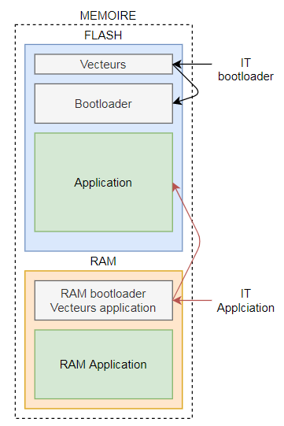
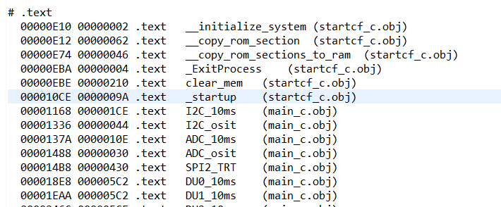

> All the references made are from MCF51AG128RM.pdf

[**1. Context**](#1) <br>
[**2. Bootloader**](#2) <br>
[a. General Algorithm](#2.1) <br>
[b.	Memory organisation](#2.2) <br>
[c.	Jump address](#2.3) <br>
[d. SPI frames](#2.4) <br>
[e. SPI commands](#2.5) <br>
[f. SPI Algorithm](#2.6) <br>
[**3. Flash memory**](#3) <br>
[a. Introduction](#3.1) <br>
[b. Flash clock configuration](#3.2) <br>
[c. Flash fuctions](#3.3) <br>
[d. Flash memory protection](#3.4) <br>
[**4. User Manual**](#4) <br>
[a. Build the program using CodeWarrior](#4.1) <br>
[b. Flash the program with a Rasberry Pie](#4.2) <br>
           

# Context <a id="1"></a>

The aim of the projet if to reflash the MCF51AG128 program through the SPI.<br>
In our case, the microcontroller is in a system where the BDM port is not accessible. So it is not reprogrammable through this one.
The communication that is accessible with the microcontroller is only with the SPI. So for the microcontroller to be reprogrammable, we have to make a bootloader where data is sent in SPI<br>
<center>

</center>

# Bootloader <a id="2"></a>

### Algorithm <a id="2.1"></a>

There is the Algorigram of the bootloader. <br>
After a reboot, the program will wait a specific SPI signal to enter in an update mode of the flash. <br>
If the SPI signal is not received, the program will jump to the application.

<center>

</center>

### Memory organisation <a id="2.2"></a>

<center>

</center>

### Jump address <a id="2.3"></a>

To launch the uploaded program, you need to jump to the _startup address.

> FLASH > Program.elf.xMAP

<center>

</center>

### SPI frames <a id="2.4"></a>

There is the frame of the write memory command (16 bits). <br>
The 32 bit values are divised into two 16 bits words.

<center>

</center>

### SPI commands <a id="2.5"></a>

> The check command don't work for now

Command | Value
--------|-------
Write memory | 80
Check memory | 100
Jump | 120

### SPI Algorithm <a id="2.6"></a>


# Flash memory <a id="3"></a>

### Introduction <a id="3.1"></a>

To manipulate the flash memory (P.86) we have to configure the flash clock between 150kHz and 200kHz (P.84). <br>
Then we have to follow a specific algorithm (P.88/89) by writing registers to made a command.

### Flash clock configuration <a id="3.2"></a>

There is the configuration path of the clock. <br>
<center>

</center>
<center>

</center>

There is the steps used to configure the flash clock with the frequency and the registers value at each steps.</br>


**BUSCLOCK**: Need to be superior than 8 MHz.<br>
**MCLK** : Physical output of the clock PIN PTA6 (P107). This output is not clearly explain is the documentation but it can be help full to verify the clock configuration.

#### Register used :
Register|Operation|Value
--------|---------|-----
ICSSC_IREFST|Choose the internal clock| 1
ICSS_CLKST|Choose the FLL|00
ICSSC_DMX32|Define the internal clock source to 32.768 kHz|1
ICSSC_DRS|Define the FLL output to 39,84MHz|01
ICSC2_BDIV|The FLL output is divided by two|01
FCDIV|The BUSCLOCK is divided by 56| 0xC7

#### Code used :

````C
	// Intern clock init 
	ICSSC = 0x70;

	// Flash clock init
	FCDIV_FDIVLD = 1;
	FCDIV_PRDIV8 = 1;
	FCDIV_FDIV = 0x8; 
````

### Flash functions <a id="3.3"></a>

#### Adress error :
To solve the address error problem, you have to change the asm_exception_handler() function into the exeption.c with the following code :

````C
asm  __declspec(register_abi) void asm_exception_handler(void)
{
	addq.l		#8, sp
}
````

Functions have been made, using commands code and algorithms, to manage the flash memory.

Function | Command | Inputs
---------|---------|-------
Flash_erase| Erase the flash memory at a specific address| address : address where the flash block have to be erased
Flash_write| Write a value to a specific address | address : address where the value have to be written <br> value : value which have to be written
Flash_burst| Write a serie of value from a specific address | address : address where the program will begin to write <br> tblvalue : table of the values <br> length : length of values

#### Debug Result

The program write the value 0x633F67E to the 0x8004 address.

<center>

</center>

#### Code

````C
void Flash_burst(unsigned long address, unsigned int tblvalue[], unsigned int length){
	unsigned int i;
	unsigned long *pdst;
	
	for (i = 0; i<length; i++){
		pdst = (unsigned long *)(address + 4*i);
		FSTAT_FCBEF = 1;
		if (!FSTAT_FACCERR && !FSTAT_FPVIOL){ FSTAT = 0x30;}
		*pdst = tblvalue[i];
		FCMD = 0x25; 
		FSTAT = 0x80;
		while (!FSTAT_FCCF){}
	}
}

void Flash_write(unsigned long address, unsigned int value){
	unsigned long *pdst = (unsigned long *)address;
	FSTAT_FCBEF = 1;
	if (!FSTAT_FACCERR && !FSTAT_FPVIOL){ FSTAT = 0x30;}
	*pdst = value;
	FCMD = 0x20; 
	FSTAT = 0x80;
	while (!FSTAT_FCCF){}
}

void Flash_erase(unsigned long address ){
	unsigned long *pdst = (unsigned long *)address;
	unsigned int value = 0x54454554;
	
	FSTAT_FCBEF = 1;
	if (!FSTAT_FACCERR && !FSTAT_FPVIOL){ FSTAT = 0x30; }
	*pdst = value;
	FCMD = 0x40; 
	FSTAT = 0x80;
	while (!FSTAT_FCCF){}
}
````

### Flash protection <a id="3.4"></a>

````C
	// Exemple protection
	FPROT_FPS = 0x77; 
	FPROT_FPOPEN = 1;
````

# User Manual <a id="4"></a>

### Build the program using CodeWarrior <a id="4.1"></a>

Before building the program you want to flash, you have to configure the origin and the lenght of the flash memory.
You also need to change the userram to not write into the vector section.
> Project_Setting > Linker_Files > Project.lcf

<center>

</center>
<center>

</center>

### Flash the program with a Rasberry Pie <a id="4.2"></a>

S19_to_BrutMemory.py : Convert the S19 into the brut memory from code.txt to BrutMemory.txt

SPI.py : Send the program through SPI and jump
